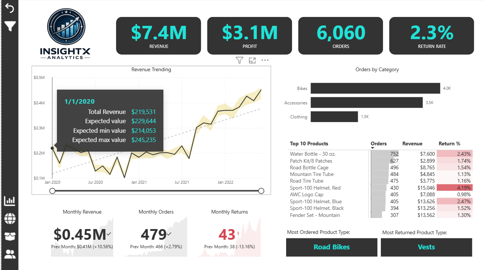
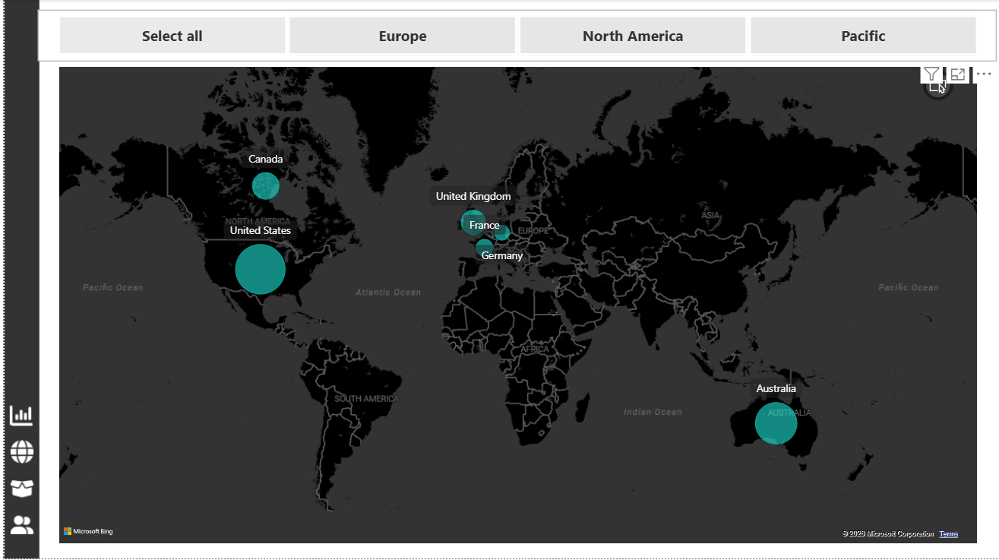
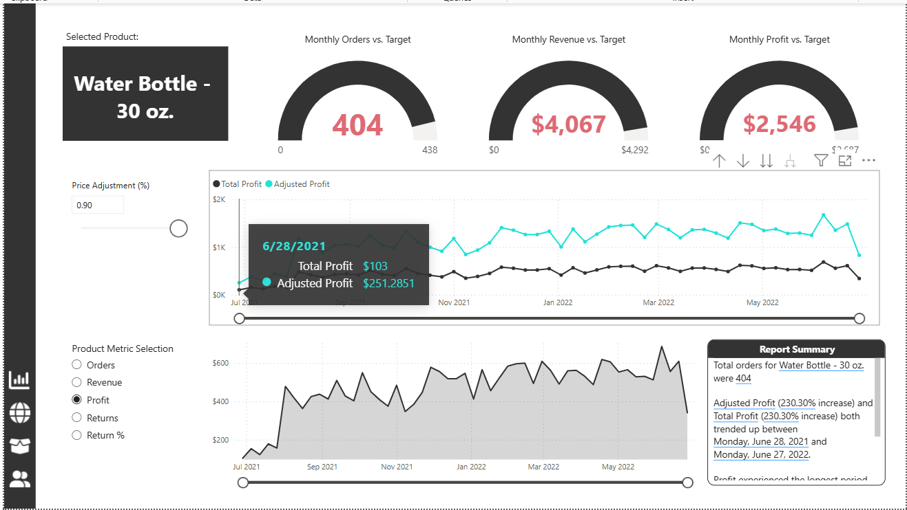
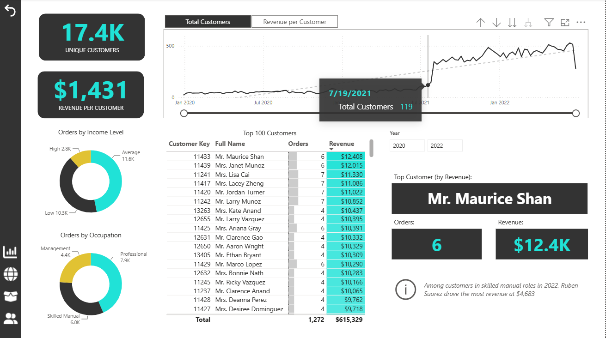

# InsightX Analytics Dashboard

## Project Overview

InsightX Analytics Dashboard is an interactive Business Intelligence solution developed using Power BI to transform raw sales data into meaningful business insights. The project focuses on analyzing sales performance, customer behavior, product trends, and return metrics through dynamic visualizations and KPI-driven reporting.

The dashboard provides a comprehensive view of key business metrics such as Total Revenue, Profit, Orders, and Return Rate. Users can explore sales trends over time, identify top-performing products, evaluate customer purchasing patterns, analyze regional performance, and monitor product return behavior. The solution is designed to support data-driven decision-making by presenting complex business information in a clear and interactive format.

A star schema data model was implemented using fact and dimension tables to ensure optimized performance and efficient data relationships. Power Query was utilized for data cleaning and transformation, while DAX measures were created to calculate advanced KPIs and business metrics. Interactive features such as filters, drill-through navigation, and cross-filtering were incorporated to enhance usability and analytical capabilities.

This project demonstrates practical expertise in data modeling, business intelligence reporting, dashboard design, Power Query, DAX, and data visualization. It showcases the ability to convert business data into actionable insights that help organizations monitor performance and identify growth opportunities.

## Tools & Technologies

* Power BI Desktop
* Power Query
* DAX (Data Analysis Expressions)
* Data Modeling
* Business Intelligence Reporting
* Data Visualization

## Skills Demonstrated

* Dashboard Design
* KPI Development
* Data Modeling
* DAX Calculations
* Data Transformation
* Business Intelligence Reporting
* Data Visualization
* Analytical Thinking

## Key Features

* Executive Dashboard with Business KPIs
* Revenue and Profit Analysis
* Order and Return Rate Monitoring
* Product Performance Analysis
* Customer Insights Dashboard
* Regional Sales Analysis
* Interactive Filtering and Drill-through Navigation
* Dynamic KPI Tracking

## Business Impact

The dashboard enables stakeholders to monitor organizational performance, identify sales trends, evaluate product demand, understand customer behavior, and make informed decisions based on data-driven insights. By consolidating multiple business metrics into a single interactive platform, the solution improves reporting efficiency and supports strategic planning.

## Dashboard Preview

### Executive Dashboard

### Regional Analysis

### Product Analysis

### Customer Analysis

## Author

**Sanket Bhaskar Patil**

Aspiring Data Analyst | SQL | Python | Power BI | Machine Learning
